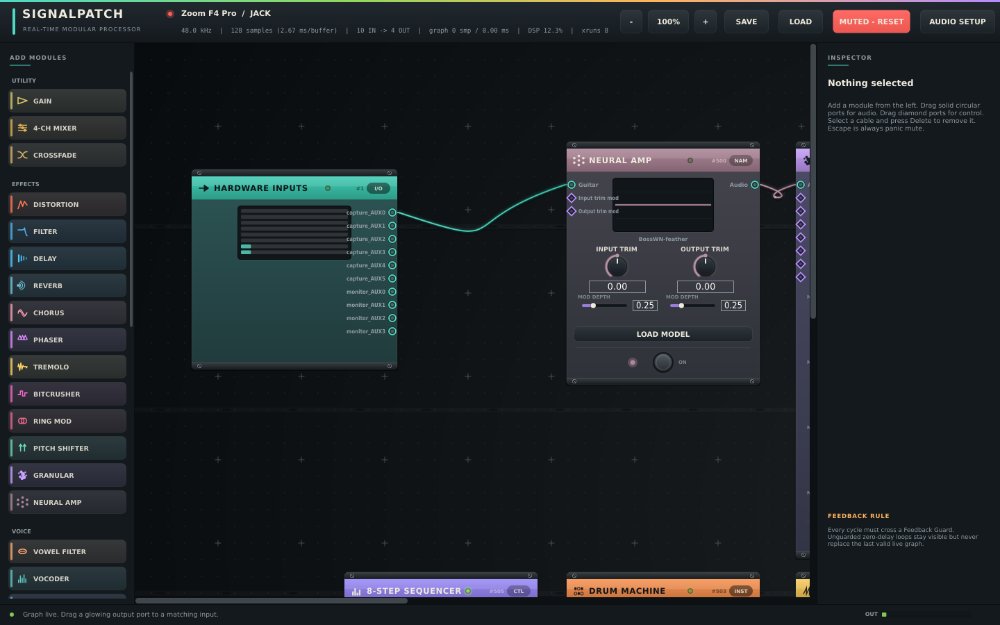

# SignalPatch

**A real-time modular rack for guitar, voice and synthesis — patch it like
hardware, play it like an instrument.**

[](https://github.com/willbearfruits/signalpatch/actions/workflows/ci.yml)
[](LICENSE)
[](https://willbearfruits.github.io/signalpatch/)



SignalPatch turns an audio interface into a patchable rack: drag cables
between modules while the sound keeps running, stomp any effect in or out of
the chain, feed real **Neural Amp Modeler** profiles, vocode and autotune a
voice, sequence a synth and a drum machine, and bounce ideas onto a virtual
4-track — all in one native C++/JUCE application built around a
real-time-safe render graph.

## The end goal

SignalPatch is being built toward a specific destination: **a handheld
device — an ASUS ROG Ally class machine — as a self-contained guitar
patching studio, voice processor and synthesizer.** Plug a guitar or a mic
into a small interface, pick up the handheld, and the whole rack is an
instrument you hold: stomp switches on triggers, macro knobs on sticks,
patching on the touchscreen. Every phase of the [roadmap](docs/ROADMAP.md)
walks toward that. The dedicated-machine build guide (stripped-down Linux,
boot-to-instrument kiosk, `--kiosk --unmute` flags, latency budgeting) lives
in [`docs/APPLIANCE.md`](docs/APPLIANCE.md).

## What it does today

- **36 modules** across seven families:
  *utility* (gain, 4-ch mixer, crossfade) ·
  *effects* (distortion, SVF filter, delay, reverb, chorus, phaser, tremolo,
  bitcrusher, ring mod, pitch shifter, granular cloud) ·
  *neural* (Neural Amp head and Neural Pedal — any .nam capture, stepped
  through your model folder like a pedal library, each showing its own
  per-block cost) ·
  *voice* (vowel/formant filter, 12-band vocoder, autotune) ·
  *instruments* (mono synth, Karplus-Strong pluck, noise, drum machine,
  live-input sampler, 60 s 4-track tape with varispeed) ·
  *dynamics* (compressor, limiter, noise gate, Feedback Guard) ·
  *control* (LFO, random S&H, envelope follower, 8-step sequencer, macro,
  FFT spectral follower, and a **Script** module that compiles a per-sample
  math expression on the fly).
- **Neural Amp Modeler, for real.** Load any `.nam` profile; parsing happens
  on a worker thread and the model swaps into the audio path atomically. The
  model path is saved with the patch, and a benchmark harness qualifies any
  folder of captures against the 64-sample deadline
  (`SIGNALPATCH_BENCH_NAM_DIR=... ./signalpatch_tests`).
- **Rack interaction.** Accent-coloured face plates with rails, screws and
  activity LEDs; true-bypass stomp footswitches; cables that sag, glow with
  signal level and carry flow pulses toward their destination; right-click
  patching; a signal-aware inspector.
- **Feedback as a feature, safely.** Cycles are legal only through a
  Feedback Guard (causal delay → DC block → finite check → hard ceiling with
  runaway latching). Outputs carry a fixed safety ceiling; loaded patches
  come back muted and fade in deliberately.
- **Everything is modulatable.** Every knob has a mod socket; any control
  signal (LFO, envelope, sequencer, spectral band, macro, MIDI later) can
  drive any parameter.
- **Session honesty.** Versioned JSON patches, autosave recovery on launch,
  device/channel identity preserved even when the interface changes.

## Engineering posture

The audio callback allocates nothing, locks nothing and never blocks — and
that is *tested*, not asserted: a global allocation trap arms around a
worst-case graph (every module, guarded feedback, live NAM inference) in the
test suite, a 30-minutes-of-audio soak runs the same graph, and the suite
passes ASan+UBSan. Graph edits compile an immutable snapshot on the message
thread and swap at a block boundary; retired snapshots are reclaimed off the
audio thread. Details: [`docs/ARCHITECTURE.md`](docs/ARCHITECTURE.md),
[`docs/REALTIME_SAFETY.md`](docs/REALTIME_SAFETY.md),
[`docs/PRODUCTION_READINESS.md`](docs/PRODUCTION_READINESS.md).

## Build

Requirements: CMake ≥ 3.22, a C++20 compiler, Ninja/Make/VS2022. JUCE 8.0.13
and NeuralAmpModelerCore are fetched automatically when not found locally
(`-DSIGNALPATCH_ALLOW_JUCE_FETCH=OFF` disables the JUCE fallback;
`-DSIGNALPATCH_ENABLE_NAM=OFF` builds without the neural amp).

### Linux

```sh
sudo apt install ninja-build libasound2-dev libjack-jackd2-dev \
  libx11-dev libxrandr-dev libxinerama-dev libxcursor-dev libxext-dev \
  libfreetype6-dev libfontconfig1-dev
cmake -S . -B build -G Ninja -DCMAKE_BUILD_TYPE=RelWithDebInfo
cmake --build build --parallel
ctest --test-dir build --output-on-failure
./build/signalpatch_artefacts/RelWithDebInfo/SignalPatch          # ALSA/JACK
pw-jack ./build/signalpatch_artefacts/RelWithDebInfo/SignalPatch  # PipeWire
```

### Flatpak

```sh
flatpak install flathub org.flatpak.Builder org.freedesktop.Sdk//24.08
flatpak run org.flatpak.Builder --user --install --force-clean \
    build-flatpak packaging/flatpak/io.github.willbearfruits.SignalPatch.yml
flatpak run io.github.willbearfruits.SignalPatch
```

### Windows

From a Visual Studio (2022 or newer) developer shell:

```powershell
cmake -S . -B build -A x64
cmake --build build --config Release --parallel
ctest --test-dir build -C Release --output-on-failure
.\build\signalpatch_artefacts\Release\SignalPatch.exe
```

(CMake picks your installed Visual Studio; add `-G "Visual Studio 17 2022"`
to pin a specific one.)

WASAPI is on by default; add `-DSIGNALPATCH_ENABLE_ASIO=ON` for ASIO (brings
the Steinberg ASIO SDK licence terms into scope).

A patch file can be passed on the command line:
`SignalPatch demo-pedalboard.signalpatch` (loads muted; press MUTED to fade
in — the same applies to the restored last session).

## Neural Amp Modeler notes

The `Neural Amp` module builds against
[NeuralAmpModelerCore](https://github.com/sdatkinson/NeuralAmpModelerCore)
(pinned commit, fetched automatically, with a tiny guard patch from
`packaging/patches/` for toolchains whose libstdc++ predates
`std::atomic<std::shared_ptr>`). Point `SIGNALPATCH_NAM_CORE_DIR` at a local
checkout to skip the fetch. Get `.nam` profiles from
[ToneHunt](https://tonehunt.org) and load them with the module's
**LOAD MODEL** button; performance qualification for heavy models at small
buffers is roadmap item 0.4.

## Documentation

| Doc | What it is |
| --- | --- |
| [`docs/ROADMAP.md`](docs/ROADMAP.md) | The ordered plan, 0.2 → handheld instrument |
| [`docs/APPLIANCE.md`](docs/APPLIANCE.md) | Building the dedicated handheld rig (ROG Ally + Zoom F4) |
| [`docs/PRODUCT.md`](docs/PRODUCT.md) | Product specification |
| [`docs/ARCHITECTURE.md`](docs/ARCHITECTURE.md) | Engine design: document → compiler → snapshot |
| [`docs/REALTIME_SAFETY.md`](docs/REALTIME_SAFETY.md) | The audio-callback contract (a release gate) |
| [`docs/NAM_ROADMAP.md`](docs/NAM_ROADMAP.md) | Neural amp staging and gates |
| [`docs/PRODUCTION_READINESS.md`](docs/PRODUCTION_READINESS.md) | Which verification gates are closed vs. open |

## Licence

SignalPatch is released under the **GNU AGPL-3.0** (see [LICENSE](LICENSE)),
matching JUCE 8's open-source licence tier. NeuralAmpModelerCore is MIT;
enabling ASIO additionally involves Steinberg's SDK licence.
