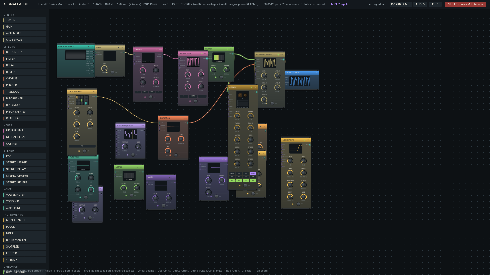
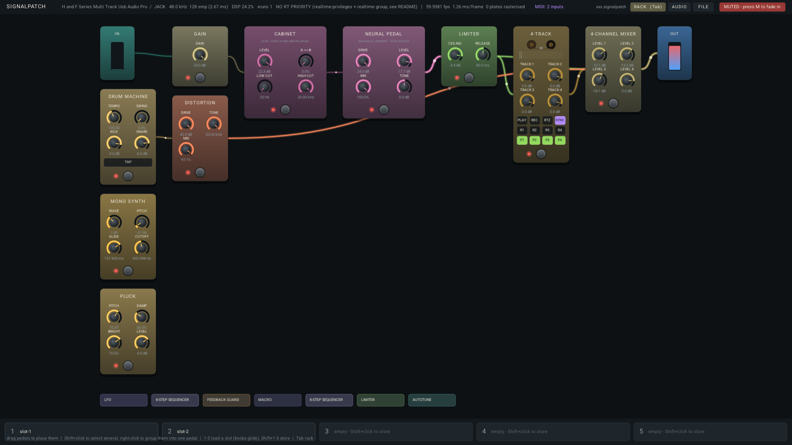
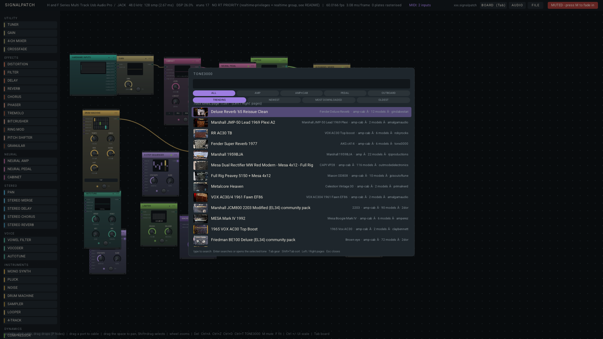

# SignalPatch

**A real-time modular rack for guitar, voice and synthesis — patch it like
hardware, play it like an instrument.**

[](https://github.com/willbearfruits/signalpatch/actions/workflows/ci.yml)
[](LICENSE)
[](https://willbearfruits.github.io/signalpatch/)

<p align="center">
  <a href="https://github.com/willbearfruits/signalpatch/actions/workflows/ci.yml"></a>
  <a href="https://github.com/willbearfruits/signalpatch/releases/latest"></a>
  <a href="./LICENSE"></a>
  <a href="https://willbearfruits.github.io/signalpatch/"></a>
</p>



<p align="center">
  
  
</p>

**Download:** [Windows (x64) and Linux (x86_64) builds on the releases page](https://github.com/willbearfruits/signalpatch/releases) — unzip, run, plug in.

SignalPatch turns an audio interface into a patchable rack: drag cables
between modules while the sound keeps running, stomp any effect in or out of
the chain, feed real **Neural Amp Modeler** profiles, vocode and autotune a
voice, sequence a synth and a drum machine, and bounce ideas onto a virtual
4-track — all in one native C++/JUCE application built around a
real-time-safe render graph.

## The end goal

SignalPatch is being built toward a specific destination: **a handheld
device — an ASUS ROG Ally class machine — as a self-contained guitar
patching studio, voice processor and synthesizer.** Plug a guitar or a mic
into a small interface, pick up the handheld, and the whole rack is an
instrument you hold: stomp switches on triggers, macro knobs on sticks,
patching on the touchscreen. Every phase of the [roadmap](docs/ROADMAP.md)
walks toward that. The dedicated-machine build guide (stripped-down Linux,
boot-to-instrument kiosk, `--kiosk --unmute` flags, latency budgeting) lives
in [`docs/APPLIANCE.md`](docs/APPLIANCE.md).

## SignalPatch 2 (current app)

The app is now a GLFW + OpenGL + NanoVG program (`SignalPatch`) over the
same engine: a rack that renders only what changed, a **Board** that shows
the patch as pedals (movable, groupable into one pedal, five rig slots whose
knobs glide between settings), MIDI learn on every knob, stomp, button, group
and slot, gamepad control, a looper, a tuner, stereo modules, recordings
saved with the patch, and portable project zips. The original JUCE rack is
retired but still builds with `-DSIGNALPATCH_BUILD_JUCE_UI=ON`.

## What it does today

- **46 modules** across eight families:
  *utility* (tuner, gain, 4-ch mixer, crossfade) ·
  *effects* (distortion, SVF filter, delay, reverb, chorus, phaser, tremolo,
  bitcrusher, ring mod, pitch shifter, granular cloud) ·
  *neural* (Neural Amp head and Neural Pedal — any .nam capture, stepped
  through your model folder like a pedal library, each showing its own
  per-block cost — and a Cabinet with two impulse responses and a blend) ·
  *stereo* (pan, stereo merge, ping-pong delay, stereo chorus, stereo
  reverb; one drag cables an L/R pair) ·
  *voice* (vowel/formant filter, 12-band vocoder, autotune) ·
  *instruments* (mono synth, Karplus-Strong pluck, noise, drum machine with
  tap tempo, live-input sampler, **looper** with overdub/undo/half-speed/
  reverse, 60 s 4-track tape with varispeed) ·
  *dynamics* (compressor, limiter, noise gate, Feedback Guard) ·
  *control* (Clock — one tempo for drums, sequencer and looper —, MIDI Note,
  LFO, random S&H, envelope follower, 8-step sequencer, macro, FFT spectral
  follower, and a **Script** module that compiles a per-sample math
  expression on the fly).
- **Play it without a mouse.** MIDI learn on every knob, stomp, button,
  group pedal and rig slot (relative encoders, expression pedal
  calibration); a foot-controller protocol with LED/label feedback over
  SysEx; a gamepad that walks the Board, stomps, turns knobs, presses pedal
  buttons and drives every menu, browser and prompt (on-screen keyboard).
- **Neural Amp Modeler, for real.** Load any `.nam` profile; parsing happens
  on a worker thread and the model swaps into the audio path atomically. The
  model path is saved with the patch, and a benchmark harness qualifies any
  folder of captures against the 64-sample deadline
  (`SIGNALPATCH_BENCH_NAM_DIR=... ./signalpatch_tests`).
- **Rack interaction.** Accent-coloured face plates with rails, screws and
  activity LEDs; true-bypass stomp footswitches; cables that sag, glow with
  signal level and carry flow pulses toward their destination; right-click
  patching; a signal-aware inspector.
- **Feedback as a feature, safely.** Cycles are legal only through a
  Feedback Guard (causal delay → DC block → finite check → hard ceiling with
  runaway latching). Outputs carry a fixed safety ceiling; loaded patches
  come back muted and fade in deliberately.
- **Everything is modulatable.** Every knob has a mod socket; any control
  signal (LFO, envelope, sequencer, spectral band, macro, MIDI Note, Clock)
  can drive any parameter.
- **Session honesty.** Versioned JSON patches with recordings alongside,
  portable project zips, autosave recovery on launch, device/channel
  identity preserved even when the interface changes, undo for everything
  (a multi-module drag is one step).

## Engineering posture

The audio callback allocates nothing, locks nothing and never blocks — and
that is *tested*, not asserted: a global allocation trap arms around a
worst-case graph (every module, guarded feedback, live NAM inference) in the
test suite, a 30-minutes-of-audio soak runs the same graph, and the suite
passes ASan+UBSan and TSan. Graph edits compile an immutable snapshot on the message
thread and swap at a block boundary; retired snapshots are reclaimed off the
audio thread. Details: [`docs/ARCHITECTURE.md`](docs/ARCHITECTURE.md),
[`docs/REALTIME_SAFETY.md`](docs/REALTIME_SAFETY.md),
[`docs/PRODUCTION_READINESS.md`](docs/PRODUCTION_READINESS.md).

## Build

Requirements: CMake ≥ 3.22, a C++20 compiler, Ninja/Make/VS2022. JUCE 8.0.13
and NeuralAmpModelerCore are fetched automatically when not found locally
(`-DSIGNALPATCH_ALLOW_JUCE_FETCH=OFF` disables the JUCE fallback;
`-DSIGNALPATCH_ENABLE_NAM=OFF` builds without the neural amp).

### Linux

```sh
sudo apt install ninja-build libasound2-dev libjack-jackd2-dev \
  libx11-dev libxrandr-dev libxinerama-dev libxcursor-dev libxext-dev \
  libfreetype6-dev libfontconfig1-dev libglfw3-dev libgl-dev libcurl4-openssl-dev
# Arch: pacman -S ninja glfw curl alsa-lib jack2 freetype2 fontconfig libx11 libxrandr libxinerama libxcursor
cmake -S . -B build -G Ninja -DCMAKE_BUILD_TYPE=RelWithDebInfo
cmake --build build --parallel
ctest --test-dir build --output-on-failure
./build/signalpatch_artefacts/RelWithDebInfo/SignalPatch          # ALSA/JACK
PIPEWIRE_QUANTUM=128/48000 pw-jack ./build/signalpatch_artefacts/RelWithDebInfo/SignalPatch  # PipeWire
```

`packaging/linux/run-from-build.sh` does the PipeWire line for you; point a
desktop entry at it to launch from the app menu without installing:

```sh
sed "s|^Exec=.*|Exec=$PWD/packaging/linux/run-from-build.sh %f|" \
  packaging/linux/io.github.willbearfruits.SignalPatch.desktop \
  > ~/.local/share/applications/io.github.willbearfruits.SignalPatch.desktop
cp packaging/linux/io.github.willbearfruits.SignalPatch.svg ~/.local/share/icons/hicolor/scalable/apps/
```

If the status bar says **NO RT PRIORITY**, the audio thread runs under the
ordinary scheduler and every busy moment on the desktop becomes an xrun. On
Arch: `pacman -S realtime-privileges && gpasswd -a $USER realtime`, then log
in again (PipeWire and its clients then take realtime through rlimits).
Avoid rtkit with PipeWire 1.6.8: it reports its time limit in a way that
makes PipeWire set `RLIMIT_RTTIME` to 0, and the kernel SIGKILLs every
process the moment its audio thread goes realtime — the app included.

### Windows (and the ROG Ally)

Every push builds `SignalPatch.exe` on the Windows CI job; the zip on the
[releases page](https://github.com/willbearfruits/signalpatch/releases)
is that build with its `fonts/` folder. Unzip anywhere and run
`SignalPatch.exe` (`--kiosk --board` for a handheld). In the AUDIO menu
pick **Windows Audio (Exclusive Mode)** and your interface for the lowest
latency; ASIO needs Steinberg's SDK and is off in these builds
(`-DSIGNALPATCH_ENABLE_ASIO=ON` with the SDK enables it). The built-in
controller of a handheld is seen as a gamepad, so the Board's pad map
applies from the start.

### Touch screens and handhelds

On a small high-DPI panel (an ROG Ally and friends) the app starts in
**touch mode**: finger-sized targets, **tap an output then an input** to
connect instead of dragging, **long press** for the menu a right click
would open, double tap on empty canvas to fit, and `-` / `+` / `FIT`
buttons in the corner. `--touch` and `--no-touch` force it; the FILE menu
carries the toggle, the UI scale and Fit, so no keyboard is needed.

### Flatpak

```sh
flatpak install flathub org.flatpak.Builder org.freedesktop.Sdk//24.08
flatpak run org.flatpak.Builder --user --install --force-clean \
    build-flatpak packaging/flatpak/io.github.willbearfruits.SignalPatch.yml
flatpak run io.github.willbearfruits.SignalPatch
```

### Windows

From a Visual Studio (2022 or newer) developer shell:

```powershell
cmake -S . -B build -A x64
cmake --build build --config Release --parallel
ctest --test-dir build -C Release --output-on-failure
.\build\signalpatch_artefacts\Release\SignalPatch.exe
```

(CMake picks your installed Visual Studio; add `-G "Visual Studio 17 2022"`
to pin a specific one.)

WASAPI is on by default; add `-DSIGNALPATCH_ENABLE_ASIO=ON` for ASIO (brings
the Steinberg ASIO SDK licence terms into scope).

A patch file can be passed on the command line:
`SignalPatch demo-pedalboard.signalpatch` (loads muted; press MUTED to fade
in — the same applies to the restored last session).

## Neural Amp Modeler notes

The `Neural Amp` module builds against
[NeuralAmpModelerCore](https://github.com/sdatkinson/NeuralAmpModelerCore)
(pinned commit, fetched automatically, with a tiny guard patch from
`packaging/patches/` for toolchains whose libstdc++ predates
`std::atomic<std::shared_ptr>`). Point `SIGNALPATCH_NAM_CORE_DIR` at a local
checkout to skip the fetch. Get `.nam` profiles from
[ToneHunt](https://tonehunt.org) and load them with the module's
**LOAD MODEL** button; performance qualification for heavy models at small
buffers is roadmap item 0.4.

## Documentation

| Doc | What it is |
| --- | --- |
| [`docs/ROADMAP.md`](docs/ROADMAP.md) | The ordered plan, 0.2 → handheld instrument |
| [`docs/CHANGELOG.md`](docs/CHANGELOG.md) | What each version brought; "Unreleased" is what `main` has beyond the last tag |
| [`docs/APPLIANCE.md`](docs/APPLIANCE.md) | Building the dedicated handheld rig (ROG Ally + Zoom F4) |
| [`docs/PRODUCT.md`](docs/PRODUCT.md) | Product specification |
| [`docs/ARCHITECTURE.md`](docs/ARCHITECTURE.md) | Engine design: document → compiler → snapshot |
| [`docs/REALTIME_SAFETY.md`](docs/REALTIME_SAFETY.md) | The audio-callback contract (a release gate) |
| [`docs/NAM_ROADMAP.md`](docs/NAM_ROADMAP.md) | Neural amp staging and gates |
| [`docs/PRODUCTION_READINESS.md`](docs/PRODUCTION_READINESS.md) | Which verification gates are closed vs. open |

## Licence

SignalPatch is released under the **GNU AGPL-3.0** (see [LICENSE](LICENSE)),
matching JUCE 8's open-source licence tier. NeuralAmpModelerCore is MIT;
enabling ASIO additionally involves Steinberg's SDK licence.
